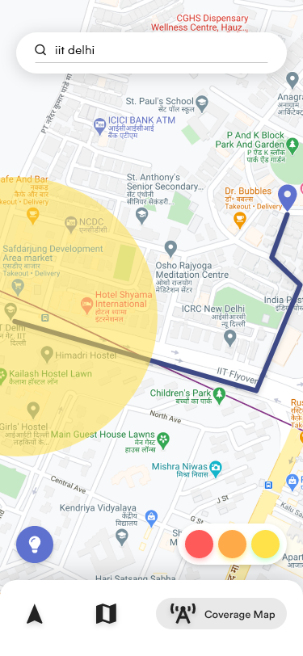

# Drishti-Hackviolet
### A cross platform mobile application having safety features for people travelling at night.

> 🏆 Dristi won **Most Innovative Mobile App** at **HackViolet 2021**

  

## Preview

## Inspiration
India ranked 52 among 57 countries in the Mastercard Index of Women Entrepreneurs with only 3% of Indian Startups being founded by women. Safety of streets at nights and access to emergency services is a big factor in this. We wanted to make something that helped women find safe routes and emergency services.

## What it does

### Safety Heatmap of Streets
Using data collected from multiple sources including user input, police cases, NGO reports and historic trends, we can make a heatmap of relative safety.

### Routing
The app also routes you through safest possible area where routes are weighted according to safety.

### Emergency Calling 
Easy access to Emergency services and cabs. Drishti will notify police in your area about your current location and call any family members you have registered previously

## How we built it
We have built a cross platform mobile application built using Flutter that will work on Android/IOS phones, desktops and as a website.

We scrape Newspapers and Public records for crimes against women and apply reverse geolocation to mark areas higher in crime. We also use User input data to mark locations on a map.

We have built a Flask Server for backend management.

## Steps to reproduce

### Mobile App
**Step 1**: Install Flutter using latest official guide [`https://flutter.dev/docs/get-started/install`](https://flutter.dev/docs/get-started/install)

**Step 2**: Run application using  `flutter run` in `App` folder

### Server
**Step 1**: Install Flask using `pip install Flask`

**Step 2**: Run server using `export FLASK_APP=server` and `flask run` in `Server` folder

## Slides

